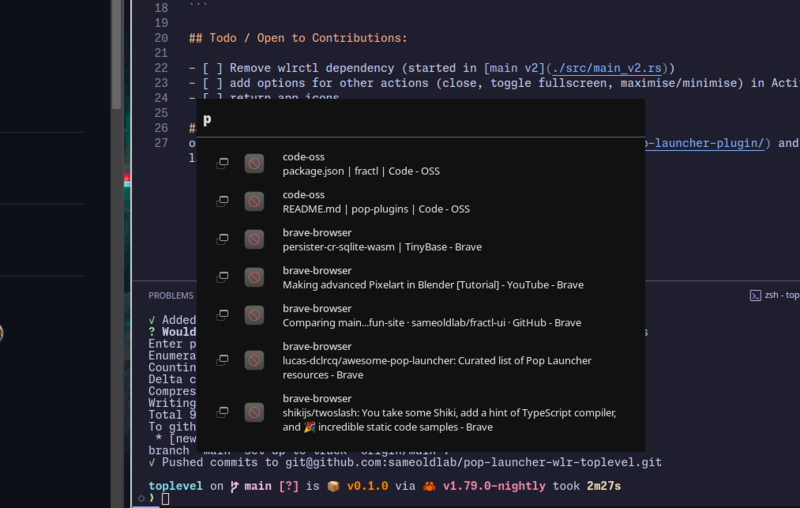

# Pop Launcher wlr-toplevel
Pop launcher plugin to find and switch windows on wayland compositors.



### Requirements
 - compositor needs to implement wlr-toplevel v1 protocol
 - [wlrctl](https://git.sr.ht/~brocellous/wlrctl)
  
### Installation
Clone the repo and run `just install` or copy and run commands in justfile. 
<!-- If you have high trust, don't value security, and learnt nothing from xz there's is also a binary availalbe on [github](https://github.com/sameoldlab/pop-launcher-wlr-toplevel/releases/tag/v0.1) -->

```sh
# From project root
cargo build --release
mkdir -p ~/.local/share/pop-launcher/plugins/toplevel
install -Dm0755 target/release/toplevel ~/.local/share/pop-launcher/plugins/toplevel/toplevel
install -Dm644 plugin.ron ~/.local/share/pop-launcher/plugins/toplevel/plugin.ron
```

## Todo / Open to Contributions:

- [ ] Remove wlrctl dependency (started in [main v2](./src/main_v2.rs))
- [ ] add options for other actions (close, toggle fullscreen, maximise/minimise) in ActivateContext
- [ ] return app icons

## Credits
oknozor's [plugin guide](https://oknozor.github.io/blog/write-a-pop-launcher-plugin/) and working version of launcher toolkit